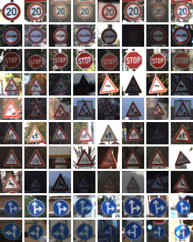
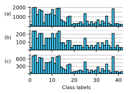

## Traffic Sign Classifier using Convolutional Neural Networks
This project consists of classifying (German) traffic signs using a convolutional neural network (CNN). A write-up is also available at [www.lrgonzales.com/traffic-sign-classifier](http://www.lrgonzales.com/traffic-sign-classifier).

<figure align="center">
  
  <figcaption> Fig.1 - Trulli, Puglia, Italy. </figcaption>
</figure>

<figcaption> **Fig. 1:** Image caption </figcaption>

<figure>
    
    
    <figcaption> Abb.1: <a href= "http://r-spatial.org//2016/11/29/openeo.html">http://r-spatial.org//2016/11/29/openeo.html </a> 
    </figcaption>
    
</figure>

.center[

.caption[
**Fig. 1:** Image caption
]

]

### Introduction
Classifying street signs is a challenging and important real-world problem, particularly with the promise of self-driving cars. The environment in which classification takes place is relatively constrained in that street signs are typically standardized for a given geographical region and the camera/s used to "see" the traffic signs is/are assumed to be positioned upright and to be stationary with respect to an observant vehicle. However, varied lighting and weather conditions — and even blur due to velocity — are expected.

### Dataset

  

The above figure shows a sampling of the dataset used, the [German Traffic Sign Dataset](http://benchmark.ini.rub.de/?section=gtsrb&subsection=news), such that each row corresponds to a unique class. Each sample is shown in the actual resolution used by the CNN — 32 x 32. Note that the dataset includes slight rotations, blurring, differing levels of brightness, and even glare within each class. Given the varied representations built into the dataset, data augmentation was not implemented. If data augmentation were to be considered, note that the oft-used vertical flip would be detrimental to some classes (e.g., last two rows of figure above).

There are a total of 43 different classes. Below is a histogram of the classes in the training, validation, and test sets. The association between traffic sign name to label number can be found here [here](http://benchmark.ini.rub.de/?section=gtsrb&subsection=news).

Preprocessing consists of resizing all of the images to a dimension of 32 x 32 x 3 (RGB), converting to grayscale [2], and normalizing from [0,255] to [−1,1).

### CNN Architecture and Training

### Improvements
Throughout the design, it became apparent that the methods used rely on a fairly smooth road, free of obstacles and relatively free of debris. For this reason, the input was preprocessed with a Gaussian blur. However, a Gaussian blur may not be enough for some unusual road surfaces or when obstacles or large debris are present. The danger is that these features could be mistaken for a lane in the algorithm. More advanced techniques, such as convolutional neural networks, could be more robust to such non-idealities.

The `src/hough.py` implementation of the Hough transform could benefit from an accumulator implemented with more efficient storage than a `list`. Doing so would likely result in on-par performance to the OpenCV implementation.

### Usage
The program can be performed on a `jpg` or `mp4` file from the `input` directory by executing `python lane_recog.py input/<file>` where `<file>` is the desired input.

`lane_recog.py` does not make use of `src/edge_det.py` or `src/hough.py`.

### Dependencies
`lane_recog.py` makes use of `numpy`, `matplotlib`, `cv2`, and `moviepy` (for `.mp4` input files).
