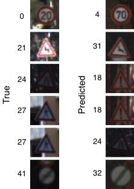

## Traffic Sign Classifier using Convolutional Neural Networks
This project consists of classifying (German) traffic signs using a convolutional neural network (CNN). Below is a sampling of the dataset with each row pertaining to a unique sign/class (stop, slippery road, etc). A write-up is also available at [www.lrgonzales.com/traffic-sign-classifier](http://www.lrgonzales.com/traffic-sign-classifier).

  

  
Fig. 1: Sampling of the German Traffic Sign Dataset   with each row pertaining to a unique sign/class.

### Introduction
Classifying street signs is a challenging and important real-world problem, particularly with the promise of self-driving cars. The environment in which classification takes place is relatively constrained in that street signs are typically standardized for a given geographical region and the camera(s) used to "see" the traffic signs is/are assumed to be positioned upright and to be stationary with respect to an observant vehicle. However, varied lighting and weather conditions — and even blur due to velocity — are expected.

### Dataset
Fig. 1 shows a sampling of the dataset used, the [German Traffic Sign Dataset](http://benchmark.ini.rub.de/?section=gtsrb&subsection=news), such that each row corresponds to a unique class. Each sample is shown in the actual resolution used by the CNN — 32 x 32. There are a total of 43 different classes. Below is a histogram of the classes in the training, validation, and test sets. The correspondence between traffic sign name and label can be found [here](https://drive.google.com/file/d/1LY-oqEmVAUGnINt9lnoH23MOkB6cFZT3/view).

  

  
Fig. 2: Histogram of the classes in the   (a) training, (b) validation, and (c) test sets.

Preprocessing consists of resizing all of the images to a dimension of 32 x 32 x 3 (RGB), converting to grayscale [2], and normalizing from [0,255] to [−1,1).

Referring to Fig. 1, note that the dataset includes slight rotations, blurring, differing levels of brightness, and even glare within each class. Given the varied representations built into the dataset, data augmentation was not implemented. If data augmentation were to be considered, note that the oft-used vertical flip would be detrimental to some classes (e.g., last two rows of Fig. 1).

### CNN Architecture and Training
The CNN architecture is inspired by ResNet and incorporates one skip-connection. A complete diagram of the architecture, depicting the activation layers, is shown below with the preprocessing layers omitted for brevity.

  

  
Fig. 3: CNN architecture used for traffic sign classification.

The learning rate and batch size were treated as hyperparameters during the training process. Once both parameters were tuned, the final training procedure included a decay of the learning rate after 80 epochs, as shown below alongside the learning curves. The model was trained using dropout on the fully-connected layers, cross-entropy loss with a final softmax activation layer, and the Adam optimizer.

  

  
Fig. 4: Learning curves with learning rate decay.

### Performance
The model achieves 98.2% accuracy on the validation set. To get a better sense for the specific errors made by the model, a confusion matrix (available [here](https://drive.google.com/file/d/15YFQTteYdOAVHGGs9GsegFDHA0cik9tw/view)) was captured using the validation set. Note that the values in the confusion matrix were rounded to a single decimal place and values less than 0.1 are left unannotated.

  

  
Fig. 5: Examples of mistakes   made on the validation set.

Fig. 5 shows examples of the errors made on the validation set, identified using the confusion matrix. The labels corresponding to the depicted traffic signs are included. All true labels in Fig. 5 had a limited number of examples (approximately 200) in the training set. As a result, data augmentation of these classes would likely reduce future errors. It's also worth noting that the third error depicted in Fig. 5 (true of 24, predicted of 18) only occurred for extremely dark examples with a label of 24. Note that the examples shown in Fig. 5 are not of the resolution used by the CNN (48 x 48, as opposed to 32 x 32).

The test set accuracy is 97.8%. The corresponding confusion matrix for the test set is available [here](https://drive.google.com/file/d/1LzWLoy17UiSOwDMT3N05WM803AZBUwNo/view) and also points to errors likely being a result of limited representation of specific labels in the training set.

### Improvements
Beyond using data augmentation for classes with limited representation, increasing the image resolution may improve performance; however, the tradeoff would be increased run-time, an important aspect in practice.

### Usage
Run `./init.sh` to obtain the dataset and the saved TensorFlow model in `./data/` and `./tf_model/`, respectively.

#### Training
Run `python ./src/sign_classifier_train.py` to train the model. The trained TensorFlow model saves to `./tf_model/`. `./src/sign_classifier_train.py` makes use of the chosen values for the hyperparameters (learning rate and batch size), but these can be changed by reassigning `alpha` and `batch_sz`.

#### Inference
Inference can be performed by running `python ./src/sign_classifier_inference.py ` where `` is a 32 x 32 RGB image compatible with `cv2.imread()`. `./imgs/stop_sign.png` is an image of a 20 KPH speed limit sign, and the terminal output is shown below.
`Class   Softmax`
`0   0.99`

### Dependencies
The project makes use of `numpy`, `matplotlib`, `tensorflow`, and `gdrive`.
